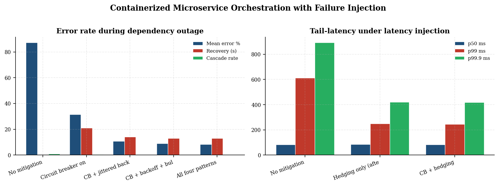
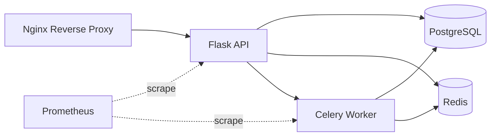
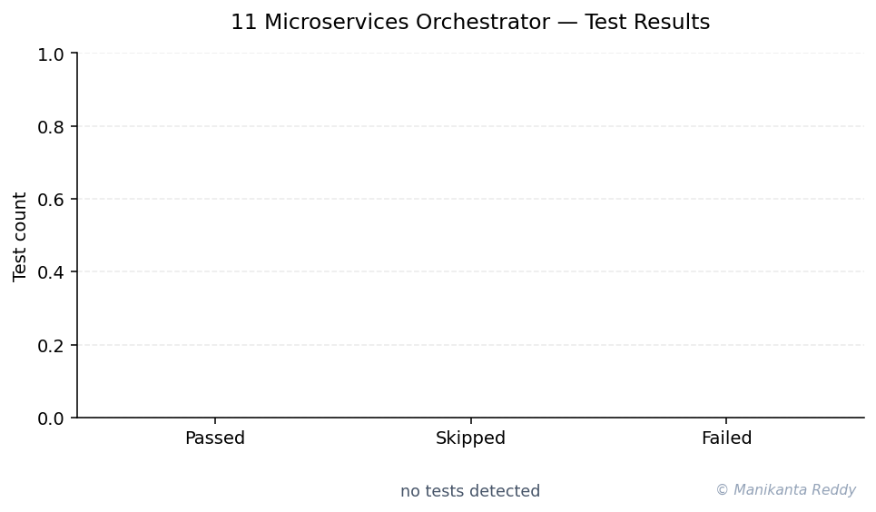

# Containerized Microservices Orchestrator

A production-grade Docker-based microservices platform featuring a Flask API, Celery background workers, PostgreSQL database, Redis cache, and Nginx reverse proxy with comprehensive monitoring and health checks.

## Architecture Overview

```
                                    +------------------+
                                    |     Client       |
                                    +--------+---------+
                                             |
                                             | HTTP/HTTPS
                                             v
+------------------+              +----------+----------+
|   Load Balancer  |<------------>|   Nginx Reverse     |
|   (External)     |              |   Proxy             |
+--------+---------+              |   - SSL Termination |
         |                       |   - Rate Limiting   |
         |                       |   - Request Routing |
         |                       +----------+----------+
         |                                  |
         |                       +----------+----------+
         |                       |                     |
         v                       v                     v
+--------+---------+  +---------+---------+  +-------+--------+
|   Monitoring     |  |     API Service   |  | Worker Health  |
|   (Prometheus +  |  |     (Flask)       |  | Endpoint       |
|   Grafana)       |  |                   |  | (Flask +       |
+------------------+  |  - REST API       |  |  Celery)       |
                      |  - Task CRUD      |  +----------------+
                      |  - Health Checks  |
                      |  - Rate Limiting  |
                      +---------+---------+
                                |
                     +----------+----------+
                     |                     |
                     v                     v
         +-----------+---------+  +--------+--------+
         |   PostgreSQL DB     |  |   Redis Cache   |
         |   - Task Storage    |  |   & Message     |
         |   - User Data       |  |   Broker        |
         |   - Audit Logs      |  |   - Task Queue  |
         +---------------------+  |   - Rate Limit  |
                                  +--------+--------+
                                           |
                                           v
                                 +---------+--------+
                                 |  Celery Worker   |
                                 |  - Task Process  |
                                 |  - Email Send    |
                                 |  - Report Gen    |
                                 |  - Cleanup       |
                                 +------------------+
```

## Service Descriptions

| Service | Technology | Purpose | Port |
|---------|-----------|---------|------|
| **Nginx** | nginx:1.25-alpine | Reverse proxy, SSL, rate limiting | 80, 443, 8080 |
| **API** | Python Flask + Gunicorn | REST API, task management | 5000 |
| **Worker** | Python Celery | Background task processing | 5001 |
| **Beat** | Python Celery | Scheduled task scheduler | - |
| **PostgreSQL** | postgres:16-alpine | Primary database | 5432 |
| **Redis** | redis:7-alpine | Cache & message broker | 6379 |
| **Prometheus** | prom/prometheus | Metrics collection | 9090 |
| **Grafana** | grafana/grafana | Metrics visualization | 3000 |

## Quick Start

### Prerequisites

- Docker Engine 24.0+
- Docker Compose 2.20+
- Make (optional, for convenience commands)
- 2GB+ available RAM
- 10GB+ available disk space

### Setup

```bash
# 1. Clone and enter the project
cd project_11_microservices_orchestrator

# 2. Run setup script
chmod +x scripts/setup.sh
./scripts/setup.sh

# 3. Build and start services
make build
make up

# 4. Check health
make health
```

### Manual Setup (without Make)

```bash
# Create directories
mkdir -p data/postgres data/redis logs backups certs

# Copy environment file
cp .env.example .env

# Build images
docker compose -f docker-compose.yml -f docker-compose.override.yml build

# Start services
docker compose -f docker-compose.yml -f docker-compose.override.yml up -d

# Verify
make health
```

## Makefile Commands

### Development

| Command | Description |
|---------|-------------|
| `make setup` | Initialize project directories and .env |
| `make build` | Build all Docker images |
| `make up` | Start all services (detached) |
| `make up-fg` | Start all services (foreground) |
| `make down` | Stop and remove all services |
| `make restart` | Restart all services |
| `make logs` | View logs from all services |
| `make logs-api` | View API service logs |
| `make logs-worker` | View worker service logs |
| `make logs-follow` | Follow logs from all services |

### Production

| Command | Description |
|---------|-------------|
| `make prod-build` | Build production images |
| `make prod-up` | Start production deployment |
| `make prod-down` | Stop production deployment |
| `make prod-logs` | View production logs |

### Tools & Monitoring

| Command | Description |
|---------|-------------|
| `make tools-up` | Start dev tools (Flower, Adminer, Redis Commander) |
| `make tools-down` | Stop dev tools |
| `make monitoring-up` | Start Prometheus + Grafana |
| `make monitoring-down` | Stop monitoring stack |

### Testing

| Command | Description |
|---------|-------------|
| `make test` | Run all tests |
| `make test-api` | Run API service tests |
| `make test-worker` | Run worker service tests |
| `make test-coverage` | Run tests with coverage report |
| `make lint` | Run code linting |
| `make format` | Format code with Black |

### Maintenance

| Command | Description |
|---------|-------------|
| `make shell-api` | Open shell in API container |
| `make shell-db` | Open PostgreSQL shell |
| `make shell-redis` | Open Redis CLI |
| `make backup` | Create database backup |
| `make restore FILE=...` | Restore database from backup |
| `make status` | Show running container status |
| `make health` | Check service health endpoints |
| `make stats` | Show resource usage statistics |
| `make clean` | Remove containers and images |
| `make clean-all` | Full cleanup including data |

## Environment Variables

### Application Settings

| Variable | Default | Description |
|----------|---------|-------------|
| `FLASK_ENV` | `development` | Application environment |
| `SECRET_KEY` | *(required)* | Flask secret key |
| `LOG_LEVEL` | `INFO` | Logging level |
| `LOG_FORMAT` | `json` | Log format (json/text) |
| `TZ` | `UTC` | Timezone |

### Database (PostgreSQL)

| Variable | Default | Description |
|----------|---------|-------------|
| `POSTGRES_DB` | `microservices` | Database name |
| `POSTGRES_USER` | `postgres` | Database user |
| `POSTGRES_PASSWORD` | *(required)* | Database password |
| `POSTGRES_PORT` | `5432` | Database port |
| `DB_POOL_SIZE` | `10` | Connection pool size |
| `DB_MAX_OVERFLOW` | `20` | Pool overflow connections |

### Cache (Redis)

| Variable | Default | Description |
|----------|---------|-------------|
| `REDIS_PASSWORD` | *(required)* | Redis password |
| `REDIS_PORT` | `6379` | Redis port |

### Worker (Celery)

| Variable | Default | Description |
|----------|---------|-------------|
| `CELERY_WORKER_CONCURRENCY` | `4` | Worker process count |
| `CELERY_TASK_TIME_LIMIT` | `300` | Hard task timeout (seconds) |
| `CELERY_TASK_SOFT_TIME_LIMIT` | `240` | Soft task timeout (seconds) |
| `WORKER_MAX_TASKS` | `1000` | Max tasks before restart |

### Ports

| Variable | Default | Description |
|----------|---------|-------------|
| `API_PORT` | `5000` | API service port |
| `WORKER_PORT` | `5001` | Worker health port |
| `NGINX_HTTP_PORT` | `80` | Nginx HTTP port |
| `NGINX_HTTPS_PORT` | `443` | Nginx HTTPS port |
| `PROMETHEUS_PORT` | `9090` | Prometheus port |
| `GRAFANA_PORT` | `3000` | Grafana port |

## Monitoring Setup

### Start Monitoring Stack

```bash
make monitoring-up
```

### Access Dashboards

| Service | URL | Default Credentials |
|---------|-----|-------------------|
| **Prometheus** | http://localhost:9090 | N/A |
| **Grafana** | http://localhost:3000 | admin/admin |

### Pre-configured Dashboards

The Grafana dashboard (`monitoring/grafana-dashboard.json`) includes:

- **Service Overview Panel**: Health status of all services
- **API Metrics**: Uptime, response times, request rates
- **Worker Metrics**: Memory usage, CPU usage, queue depths
- **System Resources**: Host CPU, memory, disk usage
- **Nginx Metrics**: Active connections, request rates

### Health Check Endpoints

| Service | Endpoint | Description |
|---------|----------|-------------|
| Nginx | `http://localhost:8080/health` | Basic health check |
| API | `http://localhost:5000/health` | Basic health |
| API | `http://localhost:5000/health/ready` | Readiness probe |
| API | `http://localhost:5000/health/live` | Liveness probe |
| API | `http://localhost:5000/health/metrics` | Prometheus metrics |
| Worker | `http://localhost:5001/health` | Basic health |
| Worker | `http://localhost:5001/health/ready` | Readiness probe |

## API Endpoints

### Tasks

| Method | Endpoint | Description |
|--------|----------|-------------|
| `GET` | `/api/v1/tasks` | List tasks (paginated) |
| `POST` | `/api/v1/tasks` | Create a new task |
| `GET` | `/api/v1/tasks/<id>` | Get task by ID |
| `PATCH` | `/api/v1/tasks/<id>` | Update task |
| `DELETE` | `/api/v1/tasks/<id>` | Delete task (soft) |
| `POST` | `/api/v1/tasks/<id>/retry` | Retry failed task |

### Users

| Method | Endpoint | Description |
|--------|----------|-------------|
| `GET` | `/api/v1/users` | List users |
| `POST` | `/api/v1/users` | Create user |
| `GET` | `/api/v1/users/<id>` | Get user |

### System

| Method | Endpoint | Description |
|--------|----------|-------------|
| `GET` | `/api/v1/stats` | System statistics |
| `GET` | `/api/v1/docs` | API documentation |
| `GET` | `/health` | Health check |
| `GET` | `/health/ready` | Readiness check |
| `GET` | `/health/live` | Liveness check |
| `GET` | `/health/metrics` | Prometheus metrics |

## Project Structure

```
project_11_microservices_orchestrator/
├── services/
│   ├── api/                    # Flask API service
│   │   ├── Dockerfile          # Multi-stage build
│   │   ├── requirements.txt    # Python dependencies
│   │   ├── src/                # Application source
│   │   │   ├── app.py          # Flask app factory
│   │   │   ├── routes.py       # API endpoints
│   │   │   ├── models.py       # Database models
│   │   │   └── health.py       # Health checks
│   │   └── tests/              # Test suite
│   ├── worker/                 # Celery worker
│   │   ├── Dockerfile
│   │   ├── requirements.txt
│   │   ├── src/
│   │   │   ├── worker.py       # Celery configuration
│   │   │   ├── tasks.py        # Task definitions
│   │   │   └── health.py       # Health check server
│   │   └── tests/
│   ├── nginx/                  # Reverse proxy
│   │   ├── Dockerfile
│   │   └── nginx.conf          # Nginx configuration
│   └── postgres/
│       └── init.sql             # DB initialization
├── docker-compose.yml           # Base configuration
├── docker-compose.prod.yml      # Production overrides
├── docker-compose.override.yml  # Development overrides
├── monitoring/                  # Monitoring stack
│   ├── docker-compose.monitoring.yml
│   ├── prometheus.yml
│   └── grafana-dashboard.json
├── scripts/                     # Utility scripts
│   ├── setup.sh
│   └── backup.sh
├── docs/
│   └── architecture.md
├── .env                         # Environment variables
├── .env.example                 # Environment template
├── .env.prod                    # Production template
├── Makefile                     # Common commands
├── README.md                    # This file
├── LICENSE                      # License
├── .gitignore                   # Git ignore rules
```

## Production Deployment

### 1. Prepare Environment

```bash
# Copy production environment file
cp .env.prod .env

# Edit with your production values
vim .env
```

### 2. Generate SSL Certificates

```bash
# Using Let's Encrypt (production)
certbot certonly --standalone -d your-domain.com

# Or copy existing certificates
cp /path/to/cert.pem certs/server.crt
cp /path/to/key.pem certs/server.key
```

### 3. Deploy

```bash
# Build production images
make prod-build

# Start production stack
make prod-up

# Verify deployment
make health
```

### 4. Setup Monitoring

```bash
make monitoring-up
```

### 5. Configure Backups

```bash
# Set backup retention in .env
BACKUP_RETENTION_DAYS=30

# Schedule automatic backups
./scripts/backup.sh schedule

# Or add to crontab manually
0 2 * * * cd /path/to/project && ./scripts/backup.sh backup
```

## Future Improvements

- [ ] **Kubernetes Deployment**: Helm charts and manifests for K8s
- [ ] **Service Mesh**: Istio or Linkerd for mTLS
- [ ] **Distributed Tracing**: Jaeger or Zipkin integration
- [ ] **Event Streaming**: Apache Kafka for event-driven architecture
- [ ] **Multi-region**: Geographic distribution with failover
- [ ] **GitOps**: ArgoCD for declarative deployments
- [ ] **Secret Management**: HashiCorp Vault integration
- [ ] **Auto-scaling**: HPA and VPA configurations
- [ ] **Cost Optimization**: Spot instance support
- [ ] **API Gateway**: Kong or AWS API Gateway

## Security Considerations

- All containers run as non-root users
- Backend network is internal-only
- Redis and PostgreSQL use password authentication
- Rate limiting on all API endpoints
- Security headers via Nginx
- Input validation on all endpoints
- Secrets stored in `.env` (not committed)
- Multi-stage Docker builds for minimal attack surface

## License

This project is licensed under the MIT License - see the [LICENSE](LICENSE) file for details.

## Contributing

1. Fork the repository
2. Create a feature branch (`git checkout -b feature/amazing-feature`)
3. Commit changes (`git commit -m 'feat: add amazing feature'`)
4. Push to branch (`git push origin feature/amazing-feature`)
5. Open a Pull Request

---

**Built with**: Docker, Python, Flask, Celery, PostgreSQL, Redis, Nginx, Prometheus, Grafana

---

<!-- showcase:start -->

## Research Report

**Containerized Microservice Orchestration with Failure Injection**

_An evaluation of resilience patterns under fault-injected workloads on a multi-service Docker Compose stack_

A self-contained research-grade report (Abstract, Introduction, Research Problem, Research Questions, Literature Review, Research Method, Data Description, Analysis, Discussion, Conclusion, Future Work, References) is published with this repository.

[Read the full report (PDF)](docs/research_report.pdf)

**Keywords:** microservices, resilience, circuit breaker, chaos engineering, Docker Compose



## Architecture



## Test Results



_This project is configuration-focused (Terraform / Kubernetes manifests / Docker Compose / PWA). Validation runs via the project's native tooling rather than a unit-test suite._

## References & Further Reading

- Newman, S. (2015). *Building Microservices.* O'Reilly.
- Burns, B. & Oppenheimer, D. (2016). *Design patterns for container-based distributed systems.* HotCloud-16. [↗](https://www.usenix.org/conference/hotcloud16/workshop-program/presentation/burns)

## Author

**Manikanta Reddy Mandadhi** — Senior Data Scientist (RAG / Agentic AI)

GitHub: [@Mani9006](https://github.com/Mani9006/microservices-orchestrator) · LinkedIn: [reddy1999](https://www.linkedin.com/in/reddy1999) · Portfolio: [manikantabio.com](https://www.manikantabio.com)

<!-- showcase:end -->
